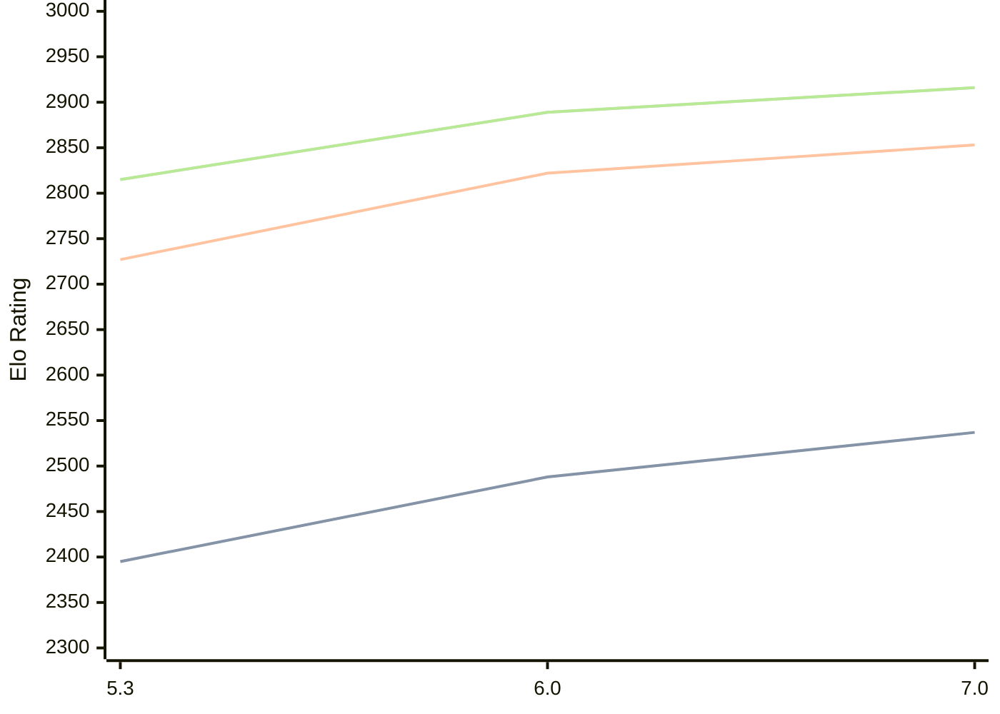

# Engine: tomitankChess

Author: Tamas Kuzmics

Home: https://github.com/tomitank/tomitankChess

## Elo Ratings E1

| Version | Published | STC 8.0+0.08s  | LTC 60.0+0.60s | VLTC 2m24s+1.12s | Comment |
| --- | --- | --- | --- | --- | --- |
| 7.0 | 2026-07-06 | 2430 | 2800 | 2843 |  |
 | | | cElo (∆ prev) | cElo (∆ prev) | cElo (∆ prev) | 

## Elo Ratings P1

| Version | Published | STC 8.0+0.08s  | LTC 60.0+0.60s | VLTC 2m24s+1.12s | Comment |
| --- | --- | --- | --- | --- | --- |
| 7.0 | 2026-07-06 | 2645 | 3000 | 3035 |  |
 | | | cElo (∆ prev) | cElo (∆ prev) | cElo (∆ prev) | 

## Elo Ratings T1

| Version | Published | STC 8.0+0.08s  | LTC 60.0+0.60s | VLTC 2m24s+1.12s | Comment |
| --- | --- | --- | --- | --- | --- |
| 7.0 | 2026-07-06 | 2537(+49) | 2853(+31) | 2916(+27) |  |
| 6.0 | 2026-03-31 | 2488(+93) | 2822(+95) | 2889(+74) |  |
| 5.3 | 2025-09-26 | 2395 | 2727 | 2815 |  |
 | | | cElo (∆ prev) | cElo (∆ prev) | cElo (∆ prev) | 

<a href="https://github.com/computer-chess-index/cci/issues/new?template=submit-version.yml&title=[VERSION]+tomitankChess+<version>&body=###%20Engine%20name%0AtomitankChess%0A%0A###%20Version%0A7.0" target="_blank">Submit new version</a>

 Test Conditions:

GUI/CLI: <a href=https://github.com/cutechess/cutechess target="_blank">Cute-Chess</a> 
Elo Calculation: <a href=https://www.remi-coulom.fr/Bayesian-Elo/ target="_blank">Bayesian-Elo</a> 
CPU for P1: Intel(R) Core(TM) Ultra 7 265T (1.50 GHz) - P-Core 
CPU for E1: Intel(R) Core(TM) Ultra 7 265T (1.50 GHz) - E-Core 
CPU for T1: Intel(R) Core(TM) i5-7500T 2.70GHz 
Opening book: 8_moves_v3 
\* STC: 8.0+0.08s, LTC: 60.0+0.60s, VLTC: 2m24s+1.12s

 Lists:
Ratings: <a href=https://github.com/computer-chess-index/cci/blob/main/lists/CCIRatings.csv target="_blank">Complete list</a>

Generated: 2026-10-09 14:17:30

## Ratings Verlauf

```mermaid
%%{init: {"theme":"base","themeVariables":{"seriesColors:['#a3a3a3','#222221','#faa371']}}}%%
xychart-beta
  x-axis ["5.3", "6.0", "7.0"]
  y-axis "Elo Rating" 2300 --> 3000
  line "" [2395, 2488, 2537]
  line "STC (8.0+0.08s)" [2395, 2488, 2537]
  line "LTC (60.0+0.60s)" [2727, 2822, 2853]
  line "" [2815, 2889, 2916]
  line "VLTC (2m24s+1.12s)" [2815, 2889, 2916]
```

## Detailed Evaluation Results

| Version | Time Control | Elo  | Range +/- | Matches | Score | Average Opponent Elo | Draws |
| --- | --- | --- | --- | --- | --- | --- | --- |
| 7.0 | VLTC (2m24s+1.12s) | 2916 | 27 | 412 | 51% | 2904 | 45% |
| 7.0 | VLTC (2m24s+1.12s) | 3035 | 39 | 196 | 46% | 3074 | 44% |
| 7.0 | VLTC (2m24s+1.12s) | 2843 | 34 | 260 | 48% | 2857 | 45% |
| 7.0 | LTC (60.0+0.60s) | 2853 | 27 | 406 | 51% | 2847 | 44% |
| 7.0 | LTC (60.0+0.60s) | 3000 | 44 | 158 | 49% | 3009 | 39% |
| 7.0 | LTC (60.0+0.60s) | 2800 | 35 | 242 | 52% | 2786 | 41% |
| 7.0 | STC (8.0+0.08s) | 2537 | 29 | 388 | 48% | 2554 | 27% |
| --- | --- | --- | --- | --- | --- | --- | --- |
| 7.0 | STC (8.0+0.08s) | 2645 | 43 | 174 | 49% | 2649 | 30% |
| --- | --- | --- | --- | --- | --- | --- | --- |
| 7.0 | STC (8.0+0.08s) | 2430 | 35 | 266 | 47% | 2460 | 31% |
| --- | --- | --- | --- | --- | --- | --- | --- |
| 6.0 | VLTC (2m24s+1.12s) | 2889 | 27 | 406 | 50% | 2890 | 43% |
| 6.0 | LTC (60.0+0.60s) | 2822 | 29 | 362 | 50% | 2819 | 38% |
| 6.0 | STC (8.0+0.08s) | 2488 | 26 | 476 | 48% | 2507 | 35% |
| --- | --- | --- | --- | --- | --- | --- | --- |
| 5.3 | VLTC (2m24s+1.12s) | 2815 | 31 | 312 | 48% | 2832 | 40% |
| 5.3 | LTC (60.0+0.60s) | 2727 | 32 | 310 | 52% | 2711 | 39% |
| 5.3 | STC (8.0+0.08s) | 2395 | 29 | 420 | 50% | 2392 | 29% |
| --- | --- | --- | --- | --- | --- | --- | --- |